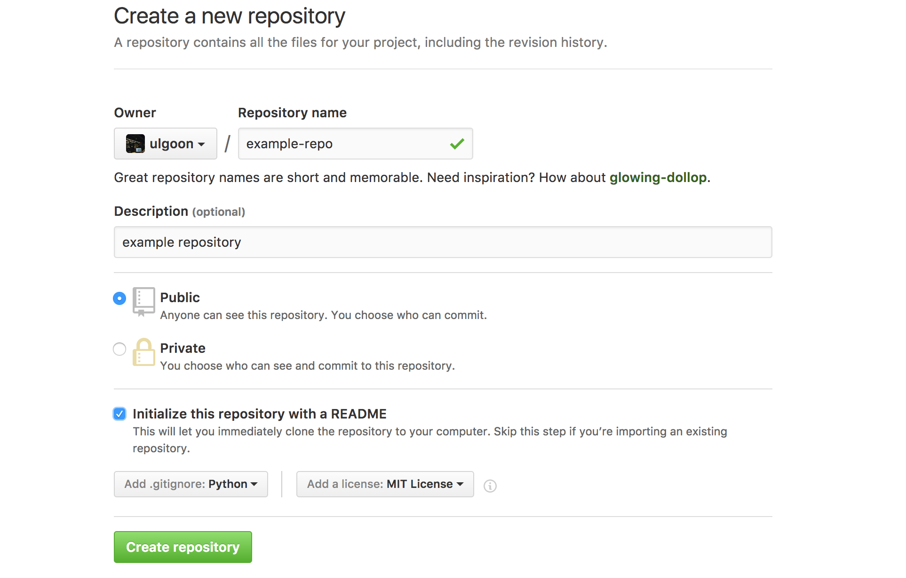
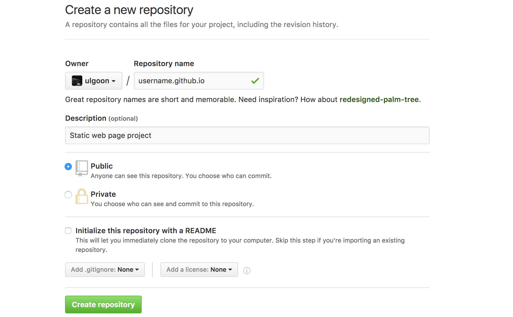

# Fastcampus 
## Computer Science SCHOOL
### git Basic
2017.1.20

---
<!-- page_number:true -->

## Introduce

### 최우영

- Solution Architect, Back-End Developer at unknown team
- Solution Architect, Web Developer, Instructor
- Skills: Python, Golang, Julia, Node.js, Google Tag Manager, ...

blog: https://ulgoon.github.io
github: https://github.com/ulgoon

---
## Version Management
동일한 정보에 대한 여러 버전을 관리하는 일

프로그램의 변경 정보 부터 릴리즈, 퍼블리싱 등의 과정을 버저닝을 통해 구분하고 관리하는 일

---
## Version Management != Configuration Management

### Version Management(버전관리)
- 버저닝을 통해 프로그램의 변경사항을 체크하고 관리하는 것

### Configuration Management(형상관리)
- Version Management + 프로젝트 진행상황까지 관리

---


---
## git
- a mild pejorative with origins in British English for an unpleasant, silly, incompetent, stupid, annoying, senile, elderly or childish person.
--> 영국 속어로 **멍청이**
- version control system (VCS) for tracking **changes** in computer files and **coordinating** work on those files among multiple people.
--> 버전 관리 시스템 + 협업
- https://git-scm.com/
- scm(Source Code Management)

---
## chronicle of git

- Developed by Linus Benedict Torvalds


---
## chronicle of git


---
## chronicle of git
### Subversion
- SVN으로도 불리는 형상관리 시스템
- 2000년, 콜랩넷에서 개발
- TortoiseSVN이 유명

---
## chronicle of git


---
## chronicle of git
- Linux Kernal을 만들기 위해 Subversion을 쓰다 화가 난 리누스 토발즈는 2주동안 git이라는 버전관리 시스템을 만듦
- https://github.com/git/git 

---
## Characteristics of git
- 빠른속도, 단순한 구조
- 분산형 저장소 지원
- 비선형적 개발(수천개의 브랜치) 가능

---
## Pros of git
- **중간-발표자료_최종_진짜최종_15-4(교수님이 맘에들어함)_언제까지??_이걸로갑시다.ppt**


- 소스코드 주고받기 없이 동시작업이 가능해져 생산성이 증가
- 수정내용은 **commit** 단위로 관리, 배포 뿐 아니라 원하는 시점으로 **Checkout** 가능
- 새로운 기능 추가는 **Branch**로 개발하여 편안한 실험이 가능하며, 성공적으로 개발이 완료되면 **Merge**하여 반영
- 인터넷이 연결되지 않아도 개발할 수 있음

---
## SVN vs git
SVN
- 중앙집중식
- 오프라인 작업 불가
git
- 분산 소스코드 관리
- 오프라인 작업 가능

---
## Structure


---
## git is not equal to github


---


---
## Useful manager for mac
http://brew.sh/index_ko.html

---
## Install git

https://git-scm.com/

```shell
// MacOS
$ brew install git
// Linux
$ sudo apt-get install git
```

- Windows: install git bash

`$ git --version` 으로 정상적으로 설치되었는지를 확인

---
## Set configuration
```shell
$ git config --global user.name "username"
$ git config --global user.email "github email address"
$ git config --list
```

---
## Signup github
https://github.com

---
## Create a repo


---
## Create a repo


---
## Create a repo


---
## git clone
`$ git clone {repo address}`

---
## add & commit


---
## git add
`$ git add {filename}`

---
## git commit
`$ git commit (option)`
```
null: messaging with vim
-m : messaging with commandline
--amend: change the last commit
```

---
## git push origin (branch name)
`$ git push -u origin (branch name)`
`-u`: remote repo의 같은 이름을 가진 브랜치로 push하도록 하고 이 정보를 가지고 있도록 함.

---
## git status
`$ git status`

---
## Another way to create repository

---
## git init
`$ git init`

---
## create some file
`$ touch index.html`

```html
<!DOCTYPE html>
<html>
	<head>
		<meta charset="utf-8">
		<title>My github Page</title>
    </head>
	<body>
		<h1>Home</h1>
		<p>Hello github & HTML!!</p>
	</body>
</html>
```

---
## git add
`$ git add {filename}`
`$ git add .`: add all current files to the next commit

---
## git commit
`$ git commit (option)`
```
null: messaging with vim
-m : messaging with commandline
```

---
## Create new repository


---
## git remote add origin (repo address)
`$ git remote add origin {repo address}`

---
## git push origin (branch name)
`$ git push -u origin (branch name)`
`-u`: remote repo의 같은 이름을 가진 브랜치로 push하도록 하고 이 정보를 가지고 있도록 함.

---
## branch


---
## git branch
show branch list
- `-a`: shows branches of local and remote repo
- `-d`: delete branch

---
## git checkout -b develop master
master --> develop
`-b`: create new branch and start it at <start_point>

---
## Homework!!
https://try.github.io/
