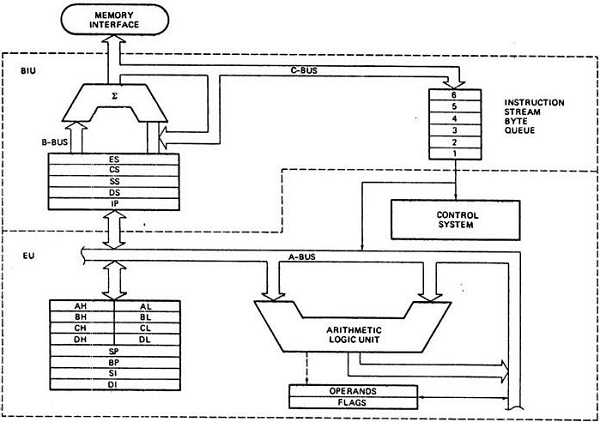

# Fastcampus
## 컴퓨터공학 입문 스쿨
### Python Basic_Day1
2017.3.27

---
<!--
page_number: true
$size: A4
footer : fastcampus 컴퓨터 공학 입문 스쿨, Wooyoung Choi, 2017
-->
## Introduce
### 최우영

- Solution Architect, Back-End Developer at unknown team
- Solution Architect, Web Developer, Instructor
- Skills: Python, Golang, Julia, Node.js, Google tag manager ...

#### blog: http://blog.ulgoon.com/
#### github: https://github.com/ulgoon/
#### email: me@ulgoon.com

---
## Computer Science

---
### Computer Science and Engineering
- 컴퓨터의 소프트웨어를 다루는 학문
- 컴퓨터라는 물리적 기기를 연구하는 것이 아닌 `Compute`r 의 개념과 구조를 이해하고 구현하는 학문

---
### Computation vs Calculation

`"calculation"` implies a strictly arithmetic process, 
whereas `"computation"` might involve applying rules in a systematic way

---
### Computer vs Calculator

- `Stored Program` computer -> Computer
	- Stores and Executes intructions
- `Fixed Program` computer -> Calculator
	- just calculate

엇? 그럼 공학용 계산기는???

---
### Computational Thinking
> 정답이 정해지지 않은 문제에 대한 해답을 일반화하는 과정

---
### Process of Computational Thinking
1) 문제 조직화(추상화) - Problem Formulation (abstraction)
2) 솔루션 구현(자동화) - Solution Expression (automation)
3) 솔루션 실행 및 평가(분석) - Solution Execution & Evaluation (analyses)

---
### Characteristics of Computational Thinking
- 문제 분해(decomposition)
- 패턴인지 / 데이터 표현(pattern recognition / data representation)
- 일반화 / 추상화(generalization / abstraction)
- 알고리즘(algorithms)

---
### Computational Thinking Process

- 문제인지
	- `배가 고프다`

---
### Computational Thinking Process

- 문제조직화
	- 문제분해
		- `뭘 먹긴 해야겠다`
			- `집에서 해결함`
				- `냉장고엔 뭐가있지? 밥은 해놨나? 라면이라도 먹을까? ...`
			- `나가서 해결함` 
				- `편의점? 식당? 패스트푸드? 레스토랑??`


---
### Computational Thinking Process

- 패턴인지
	- `아! 배가고프면 어디서 뭔가를 먹음으로써 Hunger가 False가 되는구나` 
- 일반화/추상화
	- 추상화(간결하고 명확하게 단순화, 일반화, 개념화)
		- `배가 고프면`: `{{어디}}`에서 `{{어떻게}}`해결함
	- 알고리즘

---
### Computational Thinking Process


---
### Computational Thinking Process
- 솔루션구현
- 솔루션실행 및 평가
	- `솔루션대로 실행해서 나는 배고픔을 인지하고 해결하게 되었다.`
	- `돈 보유량에 따라 다양한 선택지를 둬야겠다`
	- `집에서 밥이 없으면 굶지말고 밥을 해야겠다.`

---
### Computer

---
### Patch & Debug

---


---
### Basic Computer Architecture


---
### Basic Computer Architecture
- Program Counter - 
- ALU(Arithmetic Logic) - `+, -, *, /, AND, OR, NOT, `

---
### 8086 Architecture


---
## Shell Command

---
## Shell
> 운영체제(OS)에서 사용자의 명령을 해석하여 대신 실행해주는 프로그램

- ### Unix, Linux
`bash(ubuntu, OSX default)`, sh, zsh, csh, ksh, ...

- ### Windows
explorer.exe(for GUI Windows)
cmd.exe(for CLI MS-DOS)

---
### 몇가지 간단한 Shell 명령어
`$` : Shell 명령어의 시작

```shell
$ l
$ ls -al

$ cd Documents
$ mkdir css
$ cd css
$ mkdir python && cd python

```

---
### 몇가지 간단한 Shell 명령어
```
$ mkdir python - make directory python
$ cd python - change directory
$ cd .. - up to


$ touch hello.py - create hello.py
$ exit - terminate shell
$ mv hello.py /python
$ cp hello.py /python

$ python --version
$ python --help
```


---
## Vim
> Vi IMproved의 약자로 vi 호환 텍스트 에디터

---
## vim Basic
`$ vim hello.py`

Command
```
h,j,k,l - cursor
i - insert
v - visual
d - delete
y - yank
p - paste
u - undo
r - replace
$ - move end of line
^ - move start of line

:q - quit
:q! - quit(no warning)
:wq - write and quit

:{number} - move to {number}th line
```


---
## git Basic

---


---
## chronicle of git
- Linux Kernal을 만들기 위해 Subversion을 쓰다 화가 난 리누스 토발즈는 2주동안 git이라는 버전관리 시스템을 만듦

---
## Characteristics of git
- 빠른속도, 단순한 구조
- 분산형 저장소 지원
- 비선형적 개발(수천개의 브랜치) 가능

---
## Pros of git
- **중간-발표자료_최종_진짜최종_15-4(교수님이 맘에들어함)_언제까지??_이걸로갑시다.ppt**


- 소스코드 주고받기 없이 동시작업이 가능해져 생산성이 증가
- 수정내용은 **commit** 단위로 관리, 배포 뿐 아니라 원하는 시점으로 **Checkout** 가능
- 새로운 기능 추가는 **Branch**로 개발하여 편안한 실험이 가능하며, 성공적으로 개발이 완료되면 **Merge**하여 반영
- 인터넷이 연결되지 않아도 개발할 수 있음

---
## Structure


---
## git is not equal to github


---
## Useful manager for mac
http://brew.sh/index_ko.html


---
### install git
https://git-scm.com/

```shell
// MacOS
$ brew install git
// Linux
$ sudo apt-get install git
```

- Windows: install git bash

`$ git --version` 으로 정상적으로 설치되었는지를 확인

---
### sign up github
https://github.com/

---
## Set configuration
```shell
$ git config --global user.name "username"
$ git config --global user.email "github email address"
$ git config --list
```

---
## Python Basic

---
## Python Basic

### Python은? 
> 1989년 크리스마스 연휴를 보내던  Guido van Rossum이 만든 고급 프로그래밍 언어

### 특징
- 인터프리터
- 객체지향
- 동적타이핑
- 엄격한 문법

---
## Python Basic

Python으로 할 수 있는 것들!
- System Programming
- Web Programming
- Data Analysis
- ...

---
## Zen of Python - PEP 20
```python
import this
```

---
The Zen of Python, by Tim Peters

Beautiful is better than ugly.
Explicit is better than implicit.
Simple is better than complex.
Complex is better than complicated.
Flat is better
Sparse is better than dense.
Readability counts.

---
Special cases aren't special enough to break the rules.
Although practicality beats purity.
Errors should never pass silently.
Unless explicitly silenced.
In the face of ambiguity, refuse the temptation to guess.
There should be one-- and preferably only one --obvious way to do it.
Although that way may not be obvious at first unless you're Dutch.
Now is better than never.
Although never is often better than *right* now.
If the implementation is hard to explain, it's a bad idea.
If the implementation is easy to explain, it may be a good idea.
Namespaces are one honking great idea -- let's do more of those!

---
## Antigravity
```python
import antigravity
```

---
## Python Basic

### REPL - Read - Eval - Print Loop
코드를 입력하면 바로 결과를 확인할 수 있음!!

### We'll use python3

[difference of 2.x , 3.x](https://wiki.python.org/moin/Python2orPython3)
Short version: Python 2.x is legacy, Python 3.x is the present and future of the language

---
### version management

[pyenv setup](https://jkeun.github.io/post/python-dev-env-setting/)
[yyuu official repo](https://github.com/yyuu/pyenv)


```shell
$ git clone https://github.com/yyuu/pyenv.git ~/.pyenv

$ echo 'export PYENV_ROOT="$HOME/.pyenv"' >> ~/.bashrc
$ echo 'export PATH="$PYENV_ROOT/bin:$PATH"' >> ~/.bashrc

$ echo 'eval "$(pyenv init -)"' >> ~/.bashrc

$ source ~/.bashrc
```

```shell
$ pyenv version
$ pyenv install 3.6.0
$ pyenv shell 3.6.0
$ python --version
```

---
### pyenv troubleshooting
https://github.com/pyenv/pyenv/wiki

MacOS
```shell
$ xcode-select --install
$ brew install openssl readline xz
```

ubuntu
```shell
$ apt-get install -y make build-essential libssl-dev zlib1g-dev libbz2-dev libreadline-dev libsqlite3-dev wget curl llvm libncurses5-dev xz-utils
```

---
### Virtualenv, Autoenv
#### Virtualenv
https://github.com/pyenv/pyenv-virtualenv
```shell
$ git clone https://github.com/pyenv/pyenv-virtualenv.git $PYENV_ROOT/plugins/pyenv-virtualenv

~/.bashrc
$ echo 'eval "$(pyenv virtualenv-init -)"' >> ~/.bashrc
$ exec "$SHELL"
```
```shell
$ pyenv virtualenv 3.6.0 css-3.6.0
$ pyenv versions
```

---
### Virtualenv, Autoenv
#### Autoenv
https://github.com/kennethreitz/autoenv
```shell
$ git clone git://github.com/kennethreitz/autoenv.git ~/.autoenv
$ echo 'source ~/.autoenv/activate.sh' >> ~/.bashrc
$ exec "$SHELL"
```

```shell
$ touch .env
$ vi .env

echo 'css-3.6.0 pyenv activation'
pyenv activate css-3.6.0

$ cd ./
```
---
### Jupyter Notebook
```shell
$ pip install jupyter
$ pip list
```
```shell
$ jupyter notebook/
```
---
## Hello python!

So, let's try!!

```python
print("hello python!")
```

---
## Numbers & Math
`<object> <operator> <object>`
```python
print(3 + 7)
print(10 - 3)
print(15 / 7)
print(34 * 100)
```

---
## Numbers & Math
```python
print(15 / 7)
print(15 / 5)
type(15 / 5)

print(15 // 5)
type(15 // 5)

print(34 * 100)
print(3 * 2.5)
type(3 * 2.5)
```

---
## Boolean

```python
print(3 < 7)
print(10 < 3)
print(15 > 7)
print(34 == 100)

!=
>=
<=
```

---
## Variable

```python
print("hello python!")
hello = "hello"
python = "python!"
print(hello, python)
```
```python
num1 = 14
num2 = 5

print(num1+num2)
print(num1-num2)
print(num1*num2)
print(num1/num2)
```

---
```
$ git add .
$ git commit -m "complete python basic day1"
$ git remote add origin https://github.com/{{github_username}}/{{github_repo}}.git
$ git push origin master
```

---
## 오늘의 숙제!
반지름(`r=10`)을 선언한 뒤, 이를 이용하여 원의 지름, 둘레, 넓이, 부피를 각각 출력하는 파이썬 파일을 만들어보세요.(`pi=3.1415`) 