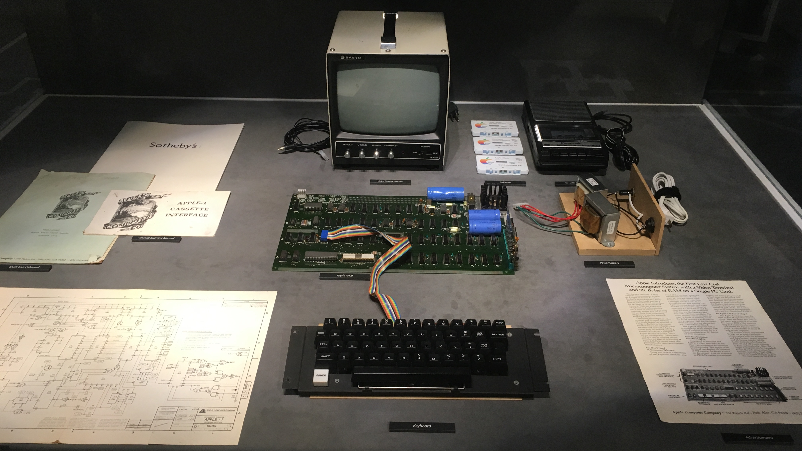
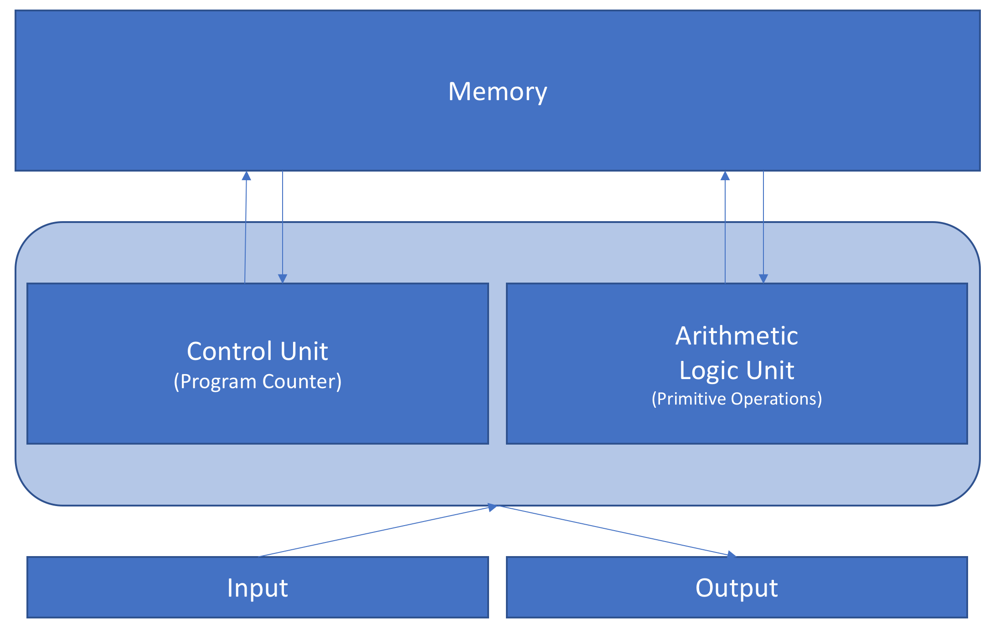
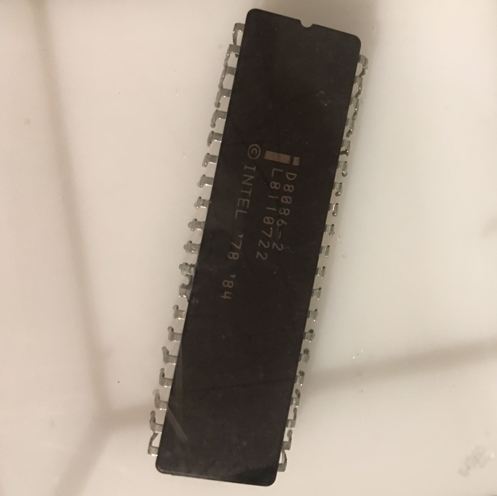

# Fastcampus
## Computer Science Extension School
### Python Basic_Day1

---
<!--
page_number: true
$size: A4
footer : fastcampus Computer Science Extension School, Wooyoung Choi, 2018
-->
## Introduce
### 최우영

- Solution Architect, Web Developer, Instructor
- Skills: Python, Golang, Julia, Node.js, Google tag manager ...

#### blog: https://blog.ulgoon.com/
#### github: https://github.com/ulgoon/
#### email: me@ulgoon.com


---
## Computer Science

---
### Computer Science and Engineering
- 컴퓨터의 소프트웨어를 다루는 학문
- 컴퓨터라는 물리적 기기를 연구하는 것이 아닌 `Compute`r 의 개념과 구조를 이해하고 구현하는 학문

---
### Computation vs Calculation

`"calculation"` implies a strictly arithmetic process, 
whereas `"computation"` might involve applying rules in a systematic way

---
### Computer vs Calculator

- `Stored Program` computer -> Computer
	- Stores and Executes intructions
- `Fixed Program` computer -> Calculator
	- just calculate 

엇? 그럼 공학용 계산기는???

---
### Computational Thinking
> 정답이 정해지지 않은 문제에 대한 해답을 일반화하는 과정

---
### Process of Computational Thinking
1) 문제 조직화(추상화) - Problem Formulation (abstraction)
2) 솔루션 구현(자동화) - Solution Expression (automation)
3) 솔루션 실행 및 평가(분석) - Solution Execution & Evaluation (analyses)

---
### Characteristics of Computational Thinking
- 문제 분해(decomposition)
- 패턴인지 / 데이터 표현(pattern recognition / data representation)
- 일반화 / 추상화(generalization / abstraction)
- 알고리즘(algorithms)

---
### Computational Thinking Process

- 문제인지
	- `배가 고프다`

---
### Computational Thinking Process

- 문제조직화
	- 문제분해
		- `뭘 먹긴 해야겠다`
			- `집에서 해결함`
				- `냉장고엔 뭐가있지? 밥은 해놨나? 라면이라도 먹을까? ...`
			- `나가서 해결함` 
				- `편의점? 식당? 패스트푸드? 레스토랑??`


---
### Computational Thinking Process

- 패턴인지
	- `아! 배가고프면 어디서 뭔가를 먹음으로써 Hunger가 False가 되는구나` 
- 일반화/추상화
	- 추상화(간결하고 명확하게 단순화, 일반화, 개념화)
		- `배가 고프면`: `{{어디}}`에서 `{{어떻게}}`해결함
	- 알고리즘

---
### Computational Thinking Process


---
### Computational Thinking Process
- 솔루션구현
- 솔루션실행 및 평가
	- `솔루션대로 실행해서 나는 배고픔을 인지하고 해결하게 되었다.`
	- `돈 보유량에 따라 다양한 선택지를 둬야겠다`
	- `집에서 밥이 없으면 굶지말고 밥을 해야겠다.`

---
### Computer


---
### Patch & Debug

---


---
### Basic Computer Architecture


---
### Basic Computer Architecture
- Program Counter - contains the address (location) of the instruction being executed at the current time
- ALU(Arithmetic Logic) - `+, -, *, /, AND, OR, NOT, `

---


---
### 8086 Architecture


---
## Python Basic

---
## Python Basic

### Python은? 
> 1989년 크리스마스 연휴를 보내던  Guido van Rossum이 만든 고급 프로그래밍 언어

### 특징
- 인터프리터
- 객체지향
- 동적타이핑
- 엄격한 문법

---
### C vs Python
```c
int main(){
int num;
for(i=0;i<=10;i++){
if (i % 2 == 0){
        	
}
}
}
```

```python
for i in range(1,10+1):
	if i % 2 == 0:
	    	print(i)
```

---
## Python Basic

Python으로 할 수 있는 것들!
- System Programming
- Web Programming
- Data Analysis
- ...

---
## Let's install Python!
<iframe width="560" height="315" src="https://www.youtube.com/embed/9Hmcp5GKdV8" frameborder="0" allow="autoplay; encrypted-media" allowfullscreen></iframe>

---
## Zen of Python - PEP 20
```python
>>> import this
```

---
The Zen of Python, by Tim Peters

Beautiful is better than ugly.
Explicit is better than implicit.
Simple is better than complex.
Complex is better than complicated.
Flat is better
Sparse is better than dense.
Readability counts.

---
Special cases aren't special enough to break the rules.
Although practicality beats purity.
Errors should never pass silently.
Unless explicitly silenced.
In the face of ambiguity, refuse the temptation to guess.
There should be one-- and preferably only one --obvious way to do it.
Although that way may not be obvious at first unless you're Dutch.
Now is better than never.
Although never is often better than *right* now.
If the implementation is hard to explain, it's a bad idea.
If the implementation is easy to explain, it may be a good idea.
Namespaces are one honking great idea -- let's do more of those!

---
## Python Basic

### REPL : Read - Eval - Print Loop
코드를 입력하면 바로 결과를 확인할 수 있음!!

```
>>> print("hello python!")
hello python!
```

### We'll use python3

[difference of 2.x , 3.x](https://wiki.python.org/moin/Python2orPython3)
Short version: Python 2.x is legacy, Python 3.x is the present and future of the language

---
### Jupyter Notebook
```shell
$ pip install jupyter
$ pip list
```
```shell
$ jupyter notebook
```
---
## Hello python!

So, let's try!!

```python
print("hello python!")
```

---
## Numbers & Math
`<object> <operator> <object>`
```python
print(3 + 7)
print(10 - 3)
print(15 / 7)
print(34 * 100)
```

---
## Numbers & Math
```python
print(15 / 7)
print(15 / 5)
type(15 / 5)

print(15 // 5)
type(15 // 5)

print(7 % 3)

print(15 ** 3)

print(34 * 100)
print(3 * 2.5)
type(3 * 2.5)
```

---
## Boolean

```python
print(3 < 7)
print(10 < 3)
print(15 > 7)
print(3 >= 3)
print(3 <= 10)
print(34 == 100)
print(34 != 100)

```

---
## Variable

```python
print("hello python!")
hello = "hello"
python = "python!"
print(hello, python)
```
```python
num1 = 14
num2 = 5

print(num1+num2)
print(num1-num2)
print(num1*num2)
print(num1/num2)
```

---
## Small Project
반지름(`r=10`)을 선언한 뒤, 이를 이용하여 원의 지름, 둘레, 넓이, 구의 겉넓이, 부피를 각각 출력하는 파이썬 파일을 만들어보세요.(`pi=3.1415`)

**sample output**
```
r = 10 ==> print("r =", r)
d = 20
c = 62.830
a = 314.15
gnb = 1256.0000
v = 4188.666666666667
```

---
## Let's Code PYTHONIC

---
## Important Python Enhance Proposal
### Layout
- 들여쓰기: 공백 4칸 or 탭(섞어쓰면 안됨)
- 한 줄은 79자(120자도 상관없음)
- 클래스정의와 최상위 함수는 두 줄을 띄움
- 클래스 내 메소드는 한 줄을 띄움

---
## Important Python Enhance Proposal
### Variables
- `_variable`: 내부적으로 사용되는 변수
- `print_` : 파이썬 키워드와 충돌 방지

---
## Naming Convention
- 클래스 이름은 `CamelCase`
- 함수, 변수, 메소드 이름은 `snake_case`

### 파이썬에서 쓰이지 않는 네이밍 규칙
- `chHungarianNotation`
- `javaScriptStyleCamelCase`

---
### Syntax
> 문법, 구조, 또는 언어 문장 내에 있는 구성요소의 순서

"나는 입니다 학생" (Syntax Error)
"나는 학생 입니다" (Syntactically Valid)

"Python"5 (Syntax Error)
3.6 * 12 (Syntactically Valid)

---
## Let's learn python with jupyter

---
### type casting
float(3) --> int to float
int(3.6) --> float to int
str(1) --> int to string
int("12") --> string to int

---
## input
```python
name = input("What is your name? ")
print("Hi, ", name)
```

## input with evaluation
```python
input("How old are you? ")
eval(input("How old are you? "))
```

---
## type casting with input
```python
int(input("How old are you? "))
```
